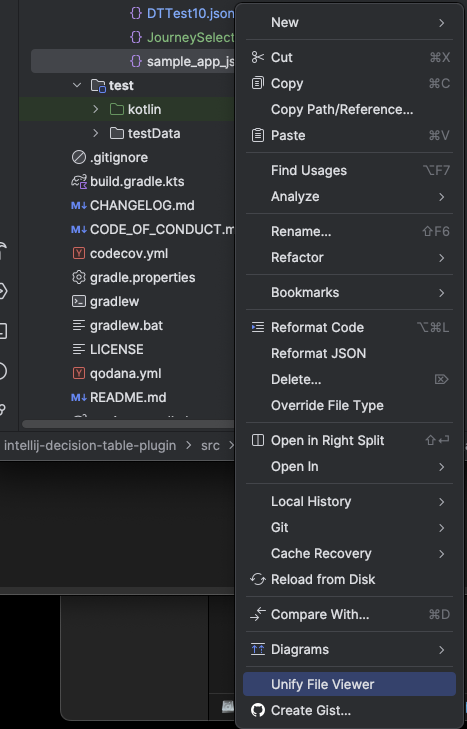
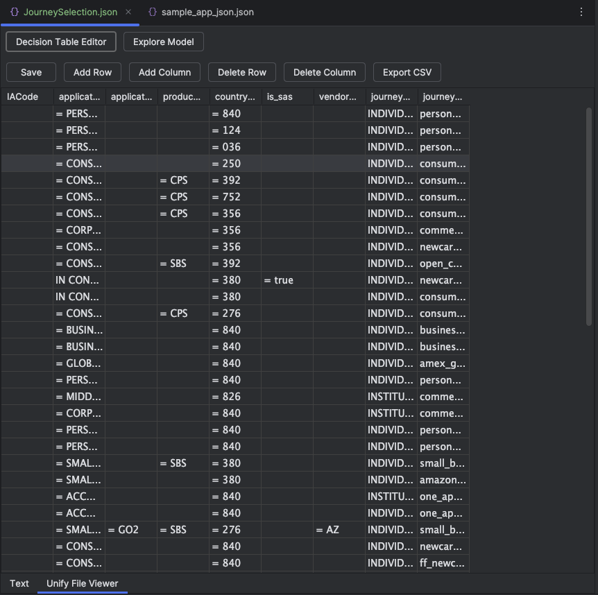
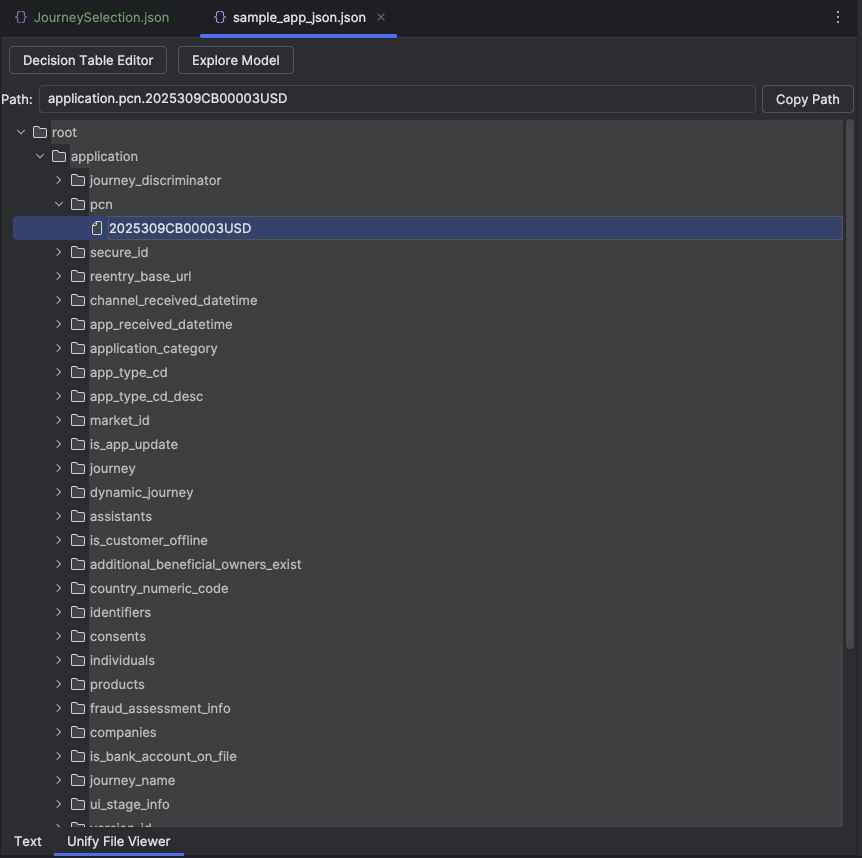

# Unify File Viewer

<!-- Plugin description -->
Unify File Viewer is an IntelliJ plugin that lets you visually explore and edit JSON files with a modern, collapsible tree view and a decision table editor. 

**Key Features:**
- Context menu action: **Unify File Viewer** for any `.json` file
- Switch between a Decision Table Editor and an Explore Model (tree) view
- Collapsible, interactive JSON explorer with path highlighting and copy support
- Table-based UI for editing decision tables
- Add/edit/remove rows and columns
- Save changes directly to JSON

<!-- Plugin description end -->

## Usage
- Right-click any `.json` file and select **Unify File Viewer**
- Switch between **Decision Table Editor** and **Explore Model** tabs in the IDE
- In Explore Model, click any node to highlight/copy its path in the JSON

---

*Unify File Viewer brings powerful, user-friendly JSON exploration and editing to your IntelliJ-based IDEs.*

## Screenshots

**Context Menu Action:**

**Decision Table Editor:**

**Explore Model View:**

## Installation

### Download from Releases
1. Go to the `releases` directory in this repository.
2. Download the latest ZIP file (e.g., `IntelliJ Platform Plugin Template-2.4.3.zip`).
3. In IntelliJ IDEA, go to **Settings > Plugins > ⚙️ > Install Plugin from Disk...**
4. Select the downloaded ZIP file and follow the prompts to install.

### Build from Source
1. Clone this repository.
2. Run `./gradlew buildPlugin` from the project root directory.
3. The distributable ZIP will be created in `build/distributions/`.
4. Install the plugin ZIP in IntelliJ IDEA as described above.

---

For development or contributing, see the [IntelliJ Platform Plugin SDK documentation](https://plugins.jetbrains.com/docs/intellij/welcome.html).
